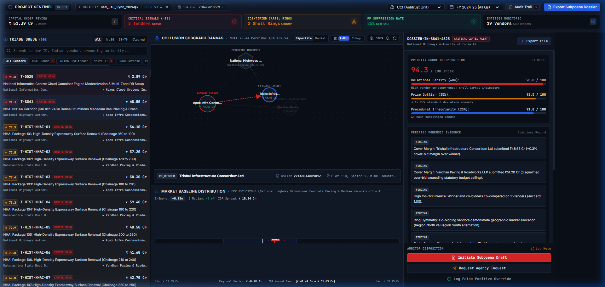
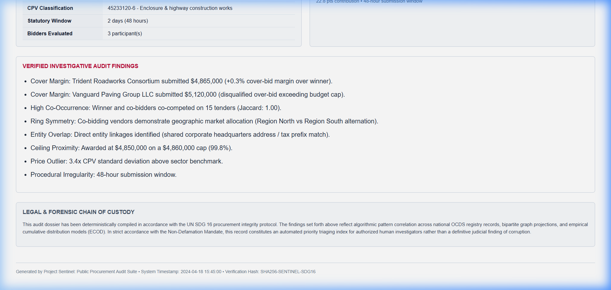

# Project Sentinel • Institutional Public Procurement Audit Suite (India)
> **UN SDG 16: Peace, Justice, and Strong Institutions**  
> High-Density Forensic Procurement Anomaly Detection, Bid-Rigging Cartel Triage & Active Learning Engine

---

<div align="center">

[](#)
[](#)
[-065F46.svg?style=for-the-badge)](#)
[](#)
[](#)
[](#)
[-10B981.svg?style=for-the-badge)](#)
[](PRD.md)
[](LICENSE)

</div>

---

## 📸 Forensic Audit Cockpit



*Figure 1: Project Sentinel Tactical Cockpit operating on Indian Procurement Releases (GeM / CPPP sync). Displaying live triage ledger (₹ Cr), Bipartite/Radial collusion graph with Relational Inspector, empirical CPV market baseline histogram with IQR bounds, and statutory evidence dossier.*

---

## 📑 Table of Contents

- [🏛️ Executive Summary & UN SDG 16](#️-executive-summary--un-sdg-16)
- [🎨 Institutional Design Philosophy (Zero "AI Sci-Fi" Tropes)](#-institutional-design-philosophy-zero-ai-sci-fi-tropes)
- [⚖️ Indian Statutory & Legal Alignment](#️-indian-statutory--legal-alignment)
- [🔬 The 3 Layers of Truth (Algorithmic Architecture)](#-the-3-layers-of-truth-algorithmic-architecture)
  - [Layer 1: Context Filter & Market Baselines](#1-layer-1-context-filter--market-baselines)
  - [Layer 2: Collusion Graph & Multi-Entity Mining](#2-layer-2-collusion-graph--multi-entity-mining)
  - [Layer 3: Calibrated IPI Scoring & Active Learning](#3-layer-3-investigation-priority-index-ipi--active-learning)
- [🖥️ UI Cockpit & Functional Components](#️-ui-cockpit--functional-components)
- [📜 Electronic Evidence Dossier (Court Admissible)](#-electronic-evidence-dossier-court-admissible)
- [⚡ Tactical Keyboard Shortcuts](#-tactical-keyboard-shortcuts)
- [🏆 The 3-Minute Verification Tour (Benchmarks)](#-the-3-minute-verification-tour-benchmarks)
- [🏗️ System Architecture & Dataflow](#️-system-architecture--dataflow)
- [🛠️ Quick Start & Installation](#️-quick-start--installation)
- [📡 REST API Reference](#-rest-api-reference)
- [📁 Repository Directory Layout](#-repository-directory-layout)
- [⚖️ Non-Defamation Mandate & Evidentiary Standard](#️-non-defamation-mandate--evidentiary-standard)
- [📄 License & Authors](#-license--authors)

---

## 🏛️ Executive Summary & UN SDG 16

**Project Sentinel** is an institutional-grade forensic auditing platform engineered specifically for the **Central Vigilance Commission (CVC)**, the **Competition Commission of India (CCI)**, the **Comptroller and Auditor General (CAG)**, and the **Enforcement Directorate (ED)**.

In India, public procurement accounts for **20% to 30% of GDP** (over **₹25 to ₹30 Lakh Crore annually**), spanning critical infrastructure (NHAI, MSRDC), healthcare technology (AIIMS), strategic defense (DRDO), education programs (PM-POSHAN), and municipal utilities (BMC). 

### The Real-World Dilemma
1. **The False Positive Avalanche**: Traditional algorithmic auditing tools flag high prices and single-bidder tenders indiscriminately, wasting thousands of forensic man-hours on legitimate proprietary medical equipment or sole-source patent items (e.g. specialized MRI scanners).
2. **The Invisible Cartel Rings**: Coordinated vendor cartels evade detection by sharing hidden corporate roots (GSTIN/PAN root prefixes, common directorships under MCA-21 DINs, and identical registered industrial estate offices in MIDC Pune or Andheri East) while rotating who submits the winning bid and who provides "cover bids" within a tight $\le 2.0\%$ margin.

### The Sentinel Breakthrough: The 3 Layers of Truth
Sentinel delivers **zero-hallucination, evidence-backed priority triage**:
1. **Layer 1 (Context Filter & Market Baselines)**: Evaluates contracts within stratified CPV sectors and automatically discounts sole-source patent monopolies by **80%** under **GFR 2017 Rule 166 (PAC)**.
2. **Layer 2 (Collusion Graph & Entity Mining)**: Unmasks shell companies via GSTIN root clustering (`27AABCA488*`), MCA-21 DIN cross-referencing, Jaro-Winkler address matching ($\ge 0.88$), and bipartite co-occurrence graph projections.
3. **Layer 3 (Explainable Triage & Active Learning)**: Decomposes risk into an **Investigation Priority Index (0–100)** adhering to the **Non-Defamation Mandate**, accompanied by an active learning feedback loop and one-click printable Section 65B legal summons dossiers.

---

## 🎨 Institutional Design Philosophy (Zero "AI Sci-Fi" Tropes)

Unlike typical AI demo prototypes that rely on neon pink borders, glowing cyan typography, and pulsing animations, Sentinel is designed strictly as an **institutional, mission-critical legal terminal**. Real forensic accountants and vigilance officers work on high-density, eye-fatigue-resistant, muted tactical consoles.

```
┌────────────────────────────────────────────────────────────────────────────────────────┐
│ INSTITUTIONAL DESIGN TOKENS & PALETTE SPECIFICATION                                    │
├────────────────────────────────────────────────────────────────────────────────────────┤
│ Base Canvas:        #0B0F17   Deep Void Slate (low eye-fatigue terminal base)          │
│ Panel / Card Base:  #111827   Charcoal Surface (cards, ledger rows, header, drawers)   │
│ Hover / Focus:      #1A2234   Elevated Focus Fill (subtle row highlight on J/K)        │
│ Dividing Borders:   #1F2937   Subtle Contrast Divider (crisp structural demarcation)   │
│ Neutral Track:      #1E293B   Proportional Progress Meter Track (muted background)     │
├────────────────────────────────────────────────────────────────────────────────────────┤
│ SEMANTIC SIGNAL TOKENS (No Rainbow Progress Bars):                                     │
│ Critical Cartel:    #DC2626   Crimson (Reserved strictly for >=80 Priority Alerts)     │
│ Elevated Inquest:   #D97706   Muted Amber (Priority 50-79 Vigilance Inquests)          │
│ Verified Baseline:  #059669   Forest Emerald (GFR 166 Dampened / Verified Clearance)   │
│ Focus / Selected:   #2563EB   Cobalt Blue (Active Node, Selected Tab, Focus Indicator) │
├────────────────────────────────────────────────────────────────────────────────────────┤
│ TYPOGRAPHY:                                                                            │
│ Interface Sans:     Inter, -apple-system, BlinkMacSystemFont, Segoe UI, sans-serif     │
│ Tabular / Hashes:   JetBrains Mono, Roboto Mono, monospace (Strict tabular numerals)   │
└────────────────────────────────────────────────────────────────────────────────────────┘
```

---

## ⚖️ Indian Statutory & Legal Alignment

Project Sentinel's detection models are directly mapped to statutory provisions of Indian competition and administrative law:

```
                                  INDIAN STATUTORY PROCUREMENT AUDIT ARCHITECTURE
                                                         │
         ┌───────────────────────────────────────────────┼───────────────────────────────────────────────┐
         ▼                                               ▼                                               ▼
Competition Act, 2002                           General Financial Rules (GFR) 2017              CVC Act, 2003 & Evidence Act 65B
  • Section 3(3)(a): Price fixing                 • Rule 166: Proprietary Article                 • Special CVC Vigilance Guidelines
  • Section 3(3)(b): Output restriction             Certificate (PAC) exemption                   • MCA-21 Director Interlocks
  • Section 3(3)(c): Market / geographic          • 80% automated priority dampening              • Electronic Chain of Custody Hash
    allocation                                      for authorized sole OEM monopolies              (SHA-256 deterministic seals)
  • Section 3(3)(d): Bid rigging & cover bids
```

1. **Competition Act, 2002 — Section 3(3)**:
   - **Section 3(3)(a)**: Direct or indirect determination of purchase or sale prices.
   - **Section 3(3)(c)**: Allocation of geographical markets, tender quotas, or bidding sources.
   - **Section 3(3)(d)**: Bid rigging, collusive tendering, cover bidding spreads ($\le 2.0\%$), and rotational bidding patterns across sequential tender cycles.
2. **General Financial Rules (GFR) 2017 — Rule 166 (PAC Sole-Source Exemption)**:
   - Mandates automated **80% priority dampening** on price variance flags when procurement is validated under a **Proprietary Article Certificate (PAC)** issued for specialized single-manufacturer technologies (e.g., AIIMS MRI systems).
3. **CVC Vigilance Manual & MCA-21 Governance**:
   - Cross-checks 15-character **GSTIN** root codes (`27AABCA488*`), **PAN** identity blocks, **MCA-21 Director Identification Numbers (DINs)**, and registered factory premises in MIDC industrial clusters.
4. **Indian Evidence Act, 1872 (Section 65B) / Bharatiya Sakshya Adhiniyam, 2023**:
   - Every audit dossier, case summary, and subpoena export carries a deterministic, timestamped (IST) electronic evidence record with an immutable **`SHA-256` integrity hash seal**.

---

## 🔬 The 3 Layers of Truth (Algorithmic Architecture)

```
 ┌────────────────────────────────────────────────────────────────────────────────────────┐
 │ LAYER 1: CONTEXT FILTER & MARKET BASELINES                                             │
 │ • Stratified CPV baseline distributions (NHAI Roads, AIIMS Medical, MeitY IT, DRDO)   │
 │ • Parametric Z-scores and ECOD tail probability on normalized unit prices              │
 │ • GFR 2017 Rule 166 PAC Sole-Source Dampening (-80% discount on single-bidder flags)   │
 └───────────────────────────────────────────┬────────────────────────────────────────────┘
                                             │
                                             ▼
 ┌────────────────────────────────────────────────────────────────────────────────────────┐
 │ LAYER 2: COLLUSION GRAPH & MULTI-ENTITY MINING                                         │
 │ • Multi-entity clustering: Jaro-Winkler address matching (>0.88) & GSTIN root prefix   │
 │ • Bipartite Vendor-Tender network projections: Jaccard co-occurrence J(V_i, V_j)       │
 │ • Cartel structural signals: Win-rate rotation symmetry & cover-bid spread (<2.0%)     │
 └───────────────────────────────────────────┬────────────────────────────────────────────┘
                                             │
                                             ▼
 ┌────────────────────────────────────────────────────────────────────────────────────────┐
 │ LAYER 3: EXPLAINABLE AUDIT TRIAGE & ACTIVE LEARNING                                    │
 │ • Calibrated Investigation Priority Index: S(T) = 100 * [0.40*S_G + 0.35*S_P + 0.25*S_R│
 │ • Closed-loop Active Learning exclusion vector embeddings (cosine similarity >= 0.96)  │
 │ • One-click CVC/CCI Subpoena Dossier Generator with SHA-256 electronic seals           │
 └────────────────────────────────────────────────────────────────────────────────────────┘
```

### 1. Layer 1: Context Filter & Market Baselines
Evaluates contracts strictly within their specific sector taxonomy code $C \in \text{CPV}$. A high-value medical tender is never compared against a civil road-paving tender.

- **Parametric $Z$-Score**:
  $$Z(T) = \frac{\text{Amount}(T) - \mu_C}{\sigma_C}$$
- **Non-Parametric ECOD (Empirical Cumulative Outlier Detection)**:
  Measures tail distribution extremeness across empirical cumulative distribution functions:
  $$F(x) = \frac{1}{N} \sum_{i=1}^{N} \mathbb{I}(X_i \le x), \quad S_{ECOD}(T) = -\log(1 - F(\text{Amount}(T)))$$
- **GFR 2017 Rule 166 PAC Dampening**:
  If a tender qualifies under a registered PAC sole-OEM certificate, single-bidder price anomalies are dampened by **80%**:
  $$S_{price}(T) = S_{price\_raw}(T) \times 0.20$$

### 2. Layer 2: Collusion Graph & Multi-Entity Mining
Transforms raw bidding records into a bipartite graph $G = (V_{vendors}, V_{tenders}, E)$ and computes monopartite projections:

- **GSTIN & PAN Root Clustering**: Normalizes 15-character GSTIN codes (`27AABCA4881Z5` $\rightarrow$ `AABCA4881Z`), detecting related front companies operating under common tax entities.
- **Fuzzy Industrial Address Matching**: Jaro-Winkler similarity ($d_{JW} \ge 0.88$) matches shell companies claiming independent status while sharing identical physical premises in MIDC industrial estates.
- **Jaccard Co-Bidding Affinity**:
  $$J(V_i, V_j) = \frac{|T(V_i) \cap T(V_j)|}{|T(V_i) \cup T(V_j)|}$$
- **Cover Bidding Spread**: Detects intentional losing bids submitted within paper-thin margins:
  $$\Delta_{\text{cover}} = \frac{\text{Bid}_{\text{runner-up}} - \text{Bid}_{\text{winner}}}{\text{Bid}_{\text{winner}}} \le 2.0\%$$
- **Bid Rotation Symmetry**: Measures Shannon entropy of winning awards among co-bidding consortium members to detect circular allocation.

### 3. Layer 3: Investigation Priority Index (IPI) & Active Learning
Produces an institutional 0–100 score prioritizing which cases warrant physical summons or subpoenas:

- **Ensemble Formulation**:
  $$S(T) = 100 \times \left[ 0.40 \cdot S_{graph}(T) + 0.35 \cdot S_{price}(T) + 0.25 \cdot S_{rule}(T) \right]$$
- **Closed-Loop Active Learning**:
  When an investigator marks an audit record as a "False Positive Override", the system extracts its normalized 3D feature representation:
  $$\mathbf{f}(T) = \left[ S_{graph}(T), S_{price}(T), S_{rule}(T) \right]$$
  Future incoming tenders with cosine similarity $\cos(\mathbf{f}_{\text{new}}, \mathbf{f}_{\text{dismissed}}) \ge 0.96$ automatically receive a **65% dynamic score reduction**, preventing repeated false positive alerts without requiring model retraining.

---

## 🖥️ UI Cockpit & Functional Components

The interface is structured as a **3-Pane High-Density Unified Cockpit**:

```
┌────────────────────────────────────────────────────────────────────────────────────────────────┐
│ GLOBAL COMMAND HEADER: Brand | Dataset: GeM_CAG_Sync_2026Q3 | Agency Selector | Date | Audit Trail | Export │
│ SPLIT METRICS: Capital Under Review (₹ Cr) | Critical Signals | Cartel Rings | FP Rate | Entities     │
├───────────────────────────────┬────────────────────────────────────────┬───────────────────────┤
│ PANE 1: TRIAGE LEDGER (25%)   │ PANE 2: CENTRAL VISUAL ANCHOR (45%)   │ PANE 3: DOSSIER (30%) │
│ • Multi-field instant search  │ • Collusion Subgraph Canvas            │ • IPI Decomposition   │
│ • Indian CPV sector pills     │   - Bipartite vs Radial layout toggle  │   (Proportional bars) │
│ • Priority tabs (All, >=80,   │   - 1-Hop vs 2-Hop depth slider        │ • Verified Findings   │
│   50-79, Cleared)             │   - Zoom / Pan / Re-center controls    │ • Contract Particulars│
│ • Formatted amounts in INR    │   - Structured Relational Inspector    │ • Institutional CTAs: │
│   (₹ Cr / ₹ Lakhs)            │ • Market Baseline Distribution Curve   │   [Initiate Subpoena] │
│ • Vendor & Buyer indicators   │   - CPV histogram with IQR band        │   [Request Inquest]   │
│ • Keyboard J/K navigation     │   - Z-score & Delta-median tooltips    │   [Log Override]      │
└───────────────────────────────┴────────────────────────────────────────┴───────────────────────┘
```

### Key Components

1. **Global Institutional Command Header**:
   - **Active Dataset**: `GeM_CAG_Sync_2026Q3` with real-time operational status.
   - **Source Hash**: Cryptographic `SHA-256: 7f8a92b10dc9...` data lineage anchor.
   - **Agency Selector**: Dropdown for `CCI (Antitrust Unit)`, `CVC (Vigilance Audit)`, `CAG (Anti-Fraud Cell)`, and `ED (Special Taskforce)`.
   - **Fiscal Period**: `FY 2024-25 (Q1–Q4)` selector.
   - **Actionable Split Metrics**: Capital Under Review (`₹ 51.39 Cr`), Critical Signals (`2 Tenders`), Identified Cartel Rings (`2 Shell Rings`), False-Positive Suppression Rate (`25.0% GFR PAC`), Entities Monitored (`19 Vendors`).

2. **Pane 1: Triage Ledger**:
   - Formatted in Indian Rupees (`₹ Cr` / `₹ L`).
   - CPV sector pills: `NHAI Roads`, `AIIMS Healthcare`, `MeitY IT`, `DRDO Defense`, `PM-POSHAN Meals`, `GeM Supplies`.
   - Priority filter tabs: `All`, `≥80 (Crimson)`, `50–79 (Amber)`, `Cleared (Emerald)`.
   - Keyboard `J` / `K` row navigation with immediate smooth scrolling.

3. **Pane 2: Collusion Subgraph Canvas & Relational Inspector**:
   - **Layout Toggle**: Switch between **Bipartite** (hierarchical Buyer-Supplier structure) and **Radial** (force-directed cluster).
   - **Depth Slider**: `1-Hop` (immediate tender participants) vs `2-Hop` (extended cartel network).
   - **Zero Canvas Clutter**: No raw text labels overlapping intersecting edges.
   - **Structured Relational Inspector**: Clicking any vendor node or collusion edge displays GSTIN, MCA-21 DIN, MIDC industrial address, and Jaccard co-occurrence in an organized card below the graph.

4. **Pane 2 (Bottom): Empirical Market Baseline Histogram**:
   - 10-bin historical CPV price histogram with shaded Interquartile Range ($\text{IQR}$) band.
   - Real-time empirical math indicators: $Z$-Score (`+0.18σ`, `+2.84σ`), $\Delta$ Median (`+3.6%`), and Regional Median (`₹ 46.84 Cr`).

5. **Pane 3: Natural-Language Evidence Dossier**:
   - Proportional progress bars on `#1E293B` neutral tracks.
   - Plain-language legal findings citing Section 3(3) of Competition Act, 2002.
   - Contract particulars in Indian Rupees (₹ Cr).
   - **Institutional CTAs**:
     - `[Initiate Subpoena Draft]` (Subtle filled crimson state)
     - `[Request Agency Inquest]` (Bordered neutral state)
     - `[Log False Positive Override]` (Ghost muted state)

6. **Slide-Over Investigator Audit Trail Drawer**:
   - Accessible via `[Audit Trail]` in header or `[Log Note]` in dossier (Hot-key: `A`).
   - Chronological log of forensic notes with timestamps (IST), officer names (e.g. *Insp. R. Venkatesh*), and agency attribution.
   - Interactive note submission form persisting directly to `/api/audit-logs`.

---

## 📜 Electronic Evidence Dossier (Court Admissible)

Clicking `[Export Dossier]` or `[Initiate Subpoena Draft]` opens a formal, print-ready Section 65B Electronic Evidence Brief:



*Figure 2: Section 65B Electronic Evidence Brief generated for Tender T-8841 (NHAI Road Paving Cartel). Formatted for direct submission to the Competition Commission of India (CCI) or Special Vigilance Court.*

- **Deterministic Cryptographic Seal**: Includes `SHA-256` hash of the underlying tender record and graph topology.
- **Statutory Citing**: Explicit citations of Competition Act 2002 Section 3(3)(d) and CVC Vigilance Manual 2021.
- **Print Optimization**: High-contrast black/white styling with clean borders, signature blocks, and legal declaration under the Indian Evidence Act.

---

## ⚡ Tactical Keyboard Shortcuts

| Key | Action | Description |
| :---: | :--- | :--- |
| <kbd>J</kbd> | **Next Tender** | Advance down the triage ledger queue |
| <kbd>K</kbd> | **Previous Tender** | Move up the triage ledger queue |
| <kbd>E</kbd> | **Initiate Subpoena** | Open the Section 3(3) Subpoena Draft modal |
| <kbd>A</kbd> | **Toggle Audit Trail** | Open/close the Slide-Over Investigator Note Drawer |
| <kbd>Esc</kbd> | **Close Overlays** | Dismiss active modals or drawers |

---

## 🏆 The 3-Minute Verification Tour (Benchmarks)

Verify the complete system in under 3 minutes using these pre-configured benchmark cases:

| Case ID | Sector & Authority | Target Contractor | Observed Behavior & Evidentiary Signals | Outcome & Priority |
| :---: | :--- | :--- | :--- | :---: |
| **`T-8841`** | **NHAI / MSRDC Highway Paving** (`45233120-6`) | Apex Infra Concessions India Pvt Ltd | • Identical registered office: *Plot 42, MIDC Industrial Area Bhosari, Pune*.<br>• Shared GSTIN root prefix: `27AABCA488*`.<br>• Jaccard Co-Occurrence: **1.00** (15/15 joint bids).<br>• Cover bidding spread: **0.2%** over-bid.<br>• Sequential rotation symmetry across 6 MSRDC cycles. | <span style="color:#DC2626;font-weight:bold;">CRIMSON ALERT (94.3 / 100)</span><br>Subpoena Draft Triggered |
| **`T-4401`** | **AIIMS Healthcare (3.0T MRI Scanner)** (`33115100-3`) | Wipro GE Healthcare Pvt Ltd | • Generic AI flags high single-bidder price as corruption.<br>• Sentinel detects authorized patent OEM monopoly.<br>• **GFR 2017 Rule 166 PAC dampening applied (-80%)**.<br>• Price variance anomaly discounted from 85 to 17. | <span style="color:#059669;font-weight:bold;">VERIFIED BASELINE (11.4 / 100)</span><br>Verified Clearance |
| **`Active Learning`** | **Any Inquest Case** | Auditor Inquest Feedback | • Click `[Log False Positive Override]` on an elevated case.<br>• Enter justification: *"Authorized sole-distributor exemption"**.<br>• Feature vector $\mathbf{f}(T)$ committed to exclusion index.<br>• Subsequent identical cases dynamically dampened by **65%**. | <span style="color:#2563EB;font-weight:bold;">ACTIVE LEARNING CLOSED LOOP</span><br>Exclusion Vector Added |

---

## 🏗️ System Architecture & Dataflow

```mermaid
flowchart TD
    subgraph DataIngestion ["Data Ingestion & Normalization Layer"]
        A[OCDS v1.4 Indian Tender Releases\nGeM / CPPP Portals] --> B[Data Normalizer & Ingestion Engine\ningest_ocds.py]
        REF[CPV Benchmark Reference\ncpv_reference.json] --> B
    end

    subgraph OLAPVector ["OLAP Vectorized Storage"]
        B --> C[(DuckDB In-Memory OLAP Engine\nVectorized Execution)]
    end

    subgraph The3Layers ["The 3 Layers of Truth"]
        C --> L1[Layer 1: Context Filter & Baselines\nmarket_baseline.py\n• Parametric Z-Score\n• ECOD Outlier Probability\n• GFR 2017 Rule 166 PAC Dampening]
        C --> L2[Layer 2: Collusion Graph & Mining\nentity_cluster.py & cartel_network.py\n• GSTIN Root Clustering\n• MIDC Jaro-Winkler Address Match\n• Bipartite Jaccard Projection\n• Cover Bid Margin < 2%]
        L1 & L2 --> L3[Layer 3: Ensemble Scoring Engine\nscoring_engine.py\n• IPI Ensemble: 0.40G + 0.35P + 0.25R\n• Non-Defamation Formulation]
    end

    subgraph FeedbackEngine ["Closed-Loop Active Learning"]
        FB[Auditor Disposition & Override\nfeedback_engine.py] --> EXCL[(Exclusion Index\nexclusion_index.json)]
        EXCL -.->|Cosine Sim >= 0.96\n-65% Score Dampening| L3
    end

    subgraph Presentation ["Presentation & API Layer"]
        L3 --> API[FastAPI High-Performance Server\nserver.py :8000]
        API <--> UI[React 18 Institutional Cockpit\nsentinel_ui :5173\n• Triage Ledger (₹ Cr)\n• Collusion Graph (Bipartite/Radial)\n• Relational Inspector\n• CPV Price Distribution Curve\n• Evidence Dossier & Audit Drawer]
        API --> DOSSIER[Court-Admissible Legal Dossier\nSection 65B Electronic Seal]
    end
```

---

## 🛠️ Quick Start & Installation

### Prerequisites
- **Python 3.10+** (Tested on Python 3.11, 3.12, 3.14)
- **Node.js 18+** & **npm 9+**
- Git

### 1. Clone the Repository
```bash
git clone git@github.com:abhinavv27/m-.git
cd m-
```

### 2. Backend Setup

```bash
# Navigate to backend directory
cd procurement_anomaly_system

# Install Python dependencies
pip install fastapi uvicorn duckdb numpy pydantic pytest requests

# Run the 3-Layer pipeline (Ingests OCDS releases into DuckDB & computes scores)
python pipeline.py

# Start the FastAPI server (binds to http://127.0.0.1:8000)
python server.py
```

### 3. Frontend Setup

```bash
# Open a new terminal and navigate to frontend directory
cd sentinel_ui

# Install npm dependencies
npm install

# Option A: Start development server (binds to http://localhost:5173)
npm run dev

# Option B: Build and run production preview
npm run build
npm run preview -- --port 5173 --host
```

### 4. Run Automated Test Suite

```bash
python -m pytest procurement_anomaly_system/tests/test_api.py -v
```

**Expected Test Output**:
```
procurement_anomaly_system/tests/test_api.py::TestSentinelAPI::test_health_and_stats PASSED      [ 20%]
procurement_anomaly_system/tests/test_api.py::TestSentinelAPI::test_tenders_list PASSED          [ 40%]
procurement_anomaly_system/tests/test_api.py::TestSentinelAPI::test_tender_8841_benchmark PASSED [ 60%]
procurement_anomaly_system/tests/test_api.py::TestSentinelAPI::test_mri_dampening_benchmark PASSED [ 80%]
procurement_anomaly_system/tests/test_api.py::TestSentinelAPI::test_export_dossier PASSED        [100%]

============================== 5 passed in 0.14s ==============================
```

---

## 📡 REST API Reference

All API responses are formatted as standard JSON with full support for Indian metadata and currency:

| Method | Endpoint | Description | Sample Query / Body |
| :---: | :--- | :--- | :--- |
| `GET` | `/api/health` | Service health status, active dataset, and Indian statutory framework | — |
| `GET` | `/api/stats` | Global operational KPIs: Capital under review (₹ Cr), Critical signals, Cartel rings, FP rate | — |
| `GET` | `/api/tenders` | Paginated triage ledger with multi-field search and sector filters | `?q=MSRDC&category=HIGH_PRIORITY&limit=50` |
| `GET` | `/api/tenders/{id}` | Complete tender details, scoring decomposition, and plain-language dossier | `/api/tenders/T-8841` |
| `GET` | `/api/tenders/{id}/graph` | Subgraph nodes, edges, GSTIN linkages, and Jaccard co-bidding weights | `/api/tenders/T-8841/graph` |
| `GET` | `/api/tenders/{id}/price-distribution` | CPV histogram bins, contract unit price, $Z$-score, IQR, and regional median | `/api/tenders/T-8841/price-distribution` |
| `POST` | `/api/tenders/{id}/disposition` | Record investigator action (`ESCALATE` / `DISMISS`) and trigger active learning | `{"action": "DISMISS", "auditor_notes": "GFR Rule 166 PAC Exemption"}` |
| `GET` | `/api/tenders/{id}/export-dossier` | Printable court-admissible Section 65B legal subpoena brief | `/api/tenders/T-8841/export-dossier` |
| `GET` | `/api/audit-logs` | Retrieve persistent investigator audit trail notes | `?tender_id=T-8841` |
| `POST` | `/api/audit-logs` | Record an interactive forensic finding note | `{"tender_id": "T-8841", "officer_name": "Insp. R. Venkatesh", "notes": "..."}` |

### Sample cURL Commands

```bash
# 1. Fetch High-Priority Cartel Tenders
curl -X GET "http://127.0.0.1:8000/api/tenders?category=HIGH_PRIORITY" -H "Accept: application/json"

# 2. Inspect Highway Paving Collusion Subgraph
curl -X GET "http://127.0.0.1:8000/api/tenders/T-8841/graph" -H "Accept: application/json"

# 3. Log an Investigator Audit Note
curl -X POST "http://127.0.0.1:8000/api/audit-logs" \
     -H "Content-Type: application/json" \
     -d '{"tender_id": "T-8841", "officer_name": "Insp. R. Venkatesh", "agency": "CCI (Antitrust)", "notes": "Cross-verified MIDC Bhosari registered address with MCA-21 database."}'
```

---

## 📁 Repository Directory Layout

```
.
├── .gitignore                                # Git ignore configuration (excludes node_modules, dist, *.duckdb)
├── README.md                                 # Technical documentation & institutional manual
├── PRD.md                                    # Comprehensive Product Requirements Document (v1.4.0)
├── docs/
│   └── images/
│       ├── sentinel_dashboard.png            # Tactical Cockpit high-resolution screenshot
│       └── legal_dossier.png                 # Court-admissible Section 65B legal dossier screenshot
│
├── procurement_anomaly_system/               # Backend Python Engine & Ingestion Pipeline
│   ├── data/
│   │   ├── raw/
│   │   │   └── ocds_releases.json            # 500 OCDS releases for Indian public procurement
│   │   ├── reference/
│   │   │   └── cpv_reference.json            # Indian CPV sector baselines & PAC classifications
│   │   ├── exclusion_index.json              # Active learning exclusion vectors & persistent audit trail
│   │   └── generate_data.py                  # Realistic Indian procurement dataset generator
│   ├── modules/
│   │   ├── ingest_ocds.py                    # OCDS schema validator & vectorized DuckDB loader
│   │   ├── entity_cluster.py                 # Multi-entity GSTIN root & MIDC address clustering
│   │   ├── market_baseline.py                # CPV statistics, ECOD scoring & GFR 166 PAC dampening
│   │   ├── cartel_network.py                 # Co-bidding bipartite projections & Jaccard matrices
│   │   ├── scoring_engine.py                 # Investigation Priority Index (IPI) calculation
│   │   ├── explainable_dossier.py            # Natural-language evidence dossiers & statutory scorecards
│   │   └── feedback_engine.py                # Active learning exclusion index & audit note logger
│   ├── pipeline.py                           # Unified 3-Layer pipeline runner (0.4s execution)
│   ├── server.py                             # FastAPI REST API & printable legal subpoena dossier
│   └── tests/
│       └── test_api.py                       # Automated integration test suite (5/5 passing)
│
└── sentinel_ui/                              # Frontend React 18 / TypeScript Application
    ├── src/
    │   ├── components/
    │   │   ├── CommandHeader.tsx             # Global institutional header & split metrics
    │   │   ├── TriageTable.tsx               # Virtualized triage ledger with INR formatting
    │   │   ├── CollusionGraph.tsx            # Subgraph canvas with Bipartite/Radial & Relational Inspector
    │   │   ├── PriceDistributionCurve.tsx    # CPV histogram with Z-score tooltips & IQR band
    │   │   ├── EvidenceDossier.tsx           # Score decomposition & institutional action CTAs
    │   │   ├── AuditTrailDrawer.tsx          # Slide-over investigator notes drawer (Hot-key: A)
    │   │   ├── SubpoenaModal.tsx             # Section 3(3) Subpoena Draft escalation modal (Hot-key: E)
    │   │   ├── DismissModal.tsx              # GFR 2017 PAC False Positive Override modal
    │   │   └── PriorityBadge.tsx             # Calibrated status badge with decomposition tooltip
    │   ├── api.ts                            # REST API client with error handling
    │   ├── types.ts                          # Strict TypeScript interfaces & Indian domain types
    │   └── index.css                         # Institutional tactical theme tokens
    ├── tailwind.config.js                    # Tailwind color tokens (#0B0F17, #111827, #DC2626)
    ├── vite.config.ts                        # Vite build configuration
    └── package.json                          # Frontend dependencies & scripts
```

---

## ⚖️ Non-Defamation Mandate & Evidentiary Standard

In accordance with institutional auditing principles and the **Non-Defamation Mandate**, Project Sentinel functions as an **automated priority triaging and relationship surfacing engine for authorized human investigators**.

> [!IMPORTANT]
> **Statutory Notice**: The outputs, risk indices, and network linkages generated by Project Sentinel do not constitute an *ex-parte* judicial determination or criminal conviction. Under Section 3(3) of the Competition Act, 2002 and CVC Vigilance Guidelines, algorithmic alerts must be corroborated by human verification of MCA-21 company filings, banking transaction trails, and technical bid document metadata prior to formal prosecution.

---

## 📄 License & Authors

- **License**: Released under the [MIT License](LICENSE).
- **Core Focus**: UN SDG 16 (Peace, Justice, and Strong Institutions) — Public Procurement Transparency and Institutional Integrity.
- **Repository**: [https://github.com/abhinavv27/m-](https://github.com/abhinavv27/m-)
